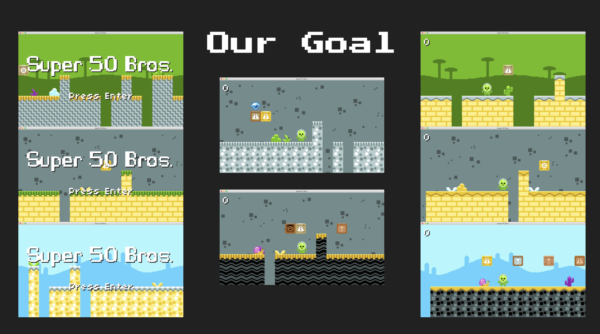

# GD50-mario
This part of the course we have already been through in CS50 assignment. However, the overall structure of the game components can be done in a better way. This is basically an advanced version of what we have achieved.

Lecture Notes: [Lecture 4](https://github.com/jazorhe/GD50-mario/blob/assignment4/lecture4.pdf)


## Overview
**Topics:**
-   Tile Maps
-   2D Animation
-   Procedural Level Generation
-   Platformer Physics
-   Basic AI
-   Powerups

**Our Goal**




<br>

## Assignment
### Objectives
-   [x] Read and understand all of the Super Mario Bros. source code from Lecture 4.
    -   [x] [main.lua](#mainlua)
    -   [x] [Dependencies.lua, constants.lua and Util.lua](#dependencieslua-constantslua-and-utillua)
    -   [x] [Tile.lua, TileMap.lua and LevelMaker.lua, GameLevel.lua](#tilelua-tilemaplua-and-levelmakerlua)
    -   [x] [Entity.lua, GameObject.lua and StateMachine.lua](#entitylua-gameobjectlua-and-statemachinelua)
    -   [x] [Player.lua, Snail.lua](#playerlua-snaillua)
    -   [x] [Player States, Snail States, Game States and Animation.lua](#player-states-snail-states-game-states-and-animationlua)


-   [x] [**Start Player Safely**](#start-player-safely): Program it such that when the player is dropped into the level, they’re always done so above solid ground.


-   [ ] [**Keys and Locks**](#keys-and-locks): In LevelMaker.lua, generate a random-colored key and lock block (taken from keys_and_locks.png in the graphics folder of the distro). The key should unlock the block when the player collides with it, triggering the block to disappear.


-   [ ] [**Spawn Goal**](#spawn-goals): Once the lock has disappeared, trigger a goal post to spawn at the end of the level. Goal posts can be found in flags.png; feel free to use whichever one you’d like! Note that the flag and the pole are separated, so you’ll have to spawn a GameObject for each segment of the flag and one for the flag itself.


-   [ ] [**Next Level**](#next-level): When the player touches this goal post, we should regenerate the level, spawn the player at the beginning of it again (this can all be done via just reloading PlayState), and make it a little longer than it was before. You’ll need to introduce params to the PlayState:enter function that keeps track of the current level and persists the player’s score for this to work properly.


<br>

### **Code Reading**

#### main.lua
`main.lua` is short and clean, only contains short `love.load()`, `love.update()` and `love.draw()`. There is a `love.resize()` for push module and a `love.keypressed()` for general keyboard purpose, but overall it only conatins the most essential information.


-   `love.load()`:
    -   Remember to put `love.graphics.setDefaultFilter('nearest', 'nearest')` before loading in any texture content (in this case, in `require 'src/Dependencies'`). Otherwise, the pixel images will not be drawn correctly
    -   `gStateMachine{}` and `gSounds{}` seemed can be placed in Dependencies.lua


-   `love.keyboard.wasPressed()` and `love.keyboard.keypressed()` can be placed in a seperate file (so can the mouse control file, see what I have done for match-3 assignment)


-   `love.update()` and `love.draw()`: see how elegant this solution has become? Everything has been handed over for gStateMachine:function() to perform, leaving the main file short and neat.


<br>

#### Dependencies.lua, constants.lua and Util.lua
Further to a normal Spritesheet -> Quad process, we need to Put all tiles and toppers spritesheets back into correct tileset and topper set orders, below method has been used:

-   In `Dependencies.lua`:
    ```lua
    -- these need to be added after gFrames is initialized because they refer to gFrames from within
    gFrames['tilesets'] = GenerateTileSets(gFrames['tiles'],
        TILE_SETS_WIDE, TILE_SETS_TALL, TILE_SET_WIDTH, TILE_SET_HEIGHT)

    gFrames['toppersets'] = GenerateTileSets(gFrames['toppers'],
        TOPPER_SETS_WIDE, TOPPER_SETS_TALL, TILE_SET_WIDTH, TILE_SET_HEIGHT)
    ```


-   With below in `constants.lua`:
    ```lua
    -- number of tile sets in sheet
    TILE_SETS_WIDE = 6
    TILE_SETS_TALL = 10

    -- number of topper sets in sheet
    TOPPER_SETS_WIDE = 6
    TOPPER_SETS_TALL = 18
    ```

-   And below in `Util.lua`:
    ```lua
    function GenerateTileSets(quads, setsX, setsY, sizeX, sizeY)
        local tilesets = {}
        local tableCounter = 0
        local sheetWidth = setsX * sizeX
        local sheetHeight = setsY * sizeY

        -- for each tile set on the X and Y
        for tilesetY = 1, setsY do
            for tilesetX = 1, setsX do

                -- tileset table
                table.insert(tilesets, {})
                tableCounter = tableCounter + 1

                for y = sizeY * (tilesetY - 1) + 1, sizeY * (tilesetY - 1) + 1 + sizeY do
                    for x = sizeX * (tilesetX - 1) + 1, sizeX * (tilesetX - 1) + 1 + sizeX do
                        table.insert(tilesets[tableCounter], quads[sheetWidth * (y - 1) + x])
                    end
                end
            end
        end

        return tilesets
    end
    ```

<br>


#### Tile.lua, TileMap.lua and LevelMaker.lua
-   Collidable funciton:
    ```lua
    function Tile:collidable(target)
        for k, v in pairs(COLLIDABLE_TILES) do
            if v == self.id then
                return true
            end
        end

        return false
    end
    ```

<br>

#### Entity.lua, GameObject.lua and StateMachine.lua
Better structure codes compared to previous versions. Include all shared attributes for **entities** accorss the game such as:
-   x and y
-   dx and dy
-   width and height
-   texture
-   **stateMachine**
-   direction
-   map (reference to tile map so we can check collisions)
-   level (reference to level for tests against other entities + objects)


StateMachine in here also plays a big role. As not only the game itself have state, but all entites and objects in game can be managed by the stateMachine and have different states with their related functions.


Shared attributes for **game objects** accorss the game such as:
-   x and y
-   width and height
-   texture
-   frame
-   solid
-   collidable
-   consumable
-   onColide (define function if apply)
-   onComsume (define function if apply)
-   hit


Here the game object class acts abit like **interface** in other languages like Java, it is a abstract class that allow other classes to implement its properties and functions however, still define their own funciton if needed.


In bigger games, it would be worth it to make Blocks and Gems also their own class. here when they are defined, they are just generic GameObjects.

Note: Block here is set to not consumable, and it does not have a `onConsume()` function defined when initialized. Thus I am still not sure how it does not trigger an error when being initialized. Maybe it won't as the function will never be triggered

Lecturer also mentioned **Entities and Components** thought process / model in mordern gaming design and game engines like Unity. He mentioned how "consumable" and "collidable" can also be components that can be added to an entity in this design thought process.


<br>

#### Player.lua, Snail.lua
Now "implement" the Entity Class, and define internal functions. Also create Entity's own states and state functions.

-   Check Collision: Three collision checks were created because of the following reasons:
    -   Tiles and other Game Objects are treated differently in this project
    -   the below check collision functions are for game objects but not tiles
    -   Tiles are checked for above collision when jumping, and below collision when falling and walking. Idle state currently does not check these, which I believe it should if the game is more complex
    -   I believe above checking an below checking should also be integrated in the Player class. Tiles should also be treated as game objects. However, I believe the lecturer did not do it for demonstration (tile sprite sheet) proposes
    -   Below are the three collision check functions in the Player class:

    ```lua
    function Player:checkLeftCollisions(dt)
        -- check for left two tiles collision
        local tileTopLeft = self.map:pointToTile(self.x + 1, self.y + 1)
        local tileBottomLeft = self.map:pointToTile(self.x + 1, self.y + self.height - 1)

        -- place player outside the X bounds on one of the tiles to reset any overlap
        if (tileTopLeft and tileBottomLeft) and (tileTopLeft:collidable() or tileBottomLeft:collidable()) then
            self.x = (tileTopLeft.x - 1) * TILE_SIZE + tileTopLeft.width - 1
        else

            self.y = self.y - 1
            local collidedObjects = self:checkObjectCollisions()
            self.y = self.y + 1

            -- reset X if new collided object
            if #collidedObjects > 0 then
                self.x = self.x + PLAYER_WALK_SPEED * dt
            end
        end
    end

    function Player:checkRightCollisions(dt)
        -- check for right two tiles collision
        local tileTopRight = self.map:pointToTile(self.x + self.width - 1, self.y + 1)
        local tileBottomRight = self.map:pointToTile(self.x + self.width - 1, self.y + self.height - 1)

        -- place player outside the X bounds on one of the tiles to reset any overlap
        if (tileTopRight and tileBottomRight) and (tileTopRight:collidable() or tileBottomRight:collidable()) then
            self.x = (tileTopRight.x - 1) * TILE_SIZE - self.width
        else

            self.y = self.y - 1
            local collidedObjects = self:checkObjectCollisions()
            self.y = self.y + 1

            -- reset X if new collided object
            if #collidedObjects > 0 then
                self.x = self.x - PLAYER_WALK_SPEED * dt
            end
        end
    end

    function Player:checkObjectCollisions()
        local collidedObjects = {}

        for k, object in pairs(self.level.objects) do
            if object:collides(self) then
                if object.solid then
                    table.insert(collidedObjects, object)
                elseif object.consumable then
                    object.onConsume(self)
                    table.remove(self.level.objects, k)
                end
            end
        end

        return collidedObjects
    end
    ```

-   `checkObjectCollisions()` is triggered first, then the list of collided objects will be iterated through each direction check


<br>

#### Player States, Snail States, Game States and Animation.lua
This is very much similar to what we had before. Snail states have a bunch of simple AI built into them, for them to be able to walk on solid ground properly. However, these actions (walk, chase, check collision etc.) can potentially be built into functions in the Snail class then called in these states. The check collision can even be defined in the Entity class more properly in order to process more types of enermies if needed.

Animation is excatly the same, but still extremly important to understand how to make it work:
```lua
Animation = Class{}

function Animation:init(def)
    self.frames = def.frames
    self.interval = def.interval
    self.timer = 0
    self.currentFrame = 1
end

function Animation:update(dt)
    -- no need to update if animation is only one frame
    if #self.frames > 1 then
        self.timer = self.timer + dt

        if self.timer > self.interval then
            self.timer = self.timer % self.interval

            self.currentFrame = math.max(1, (self.currentFrame + 1) % (#self.frames + 1))
        end
    end
end

function Animation:getCurrentFrame()
    return self.frames[self.currentFrame]
end
```

<br>

### Start Player Safely
Program it such that when the player is dropped into the level, they’re always done so above solid ground. Just like we generate the level column by column (as can be seen in `LevelMaker.lua`), we can check the game’s map column by column and simply ensure that the player isn’t placed above a column that just spawned a chasm by looking at all of the tiles along the Y-axis, going from left to right, until we’ve come across a column where we encounter a solid tile (as by checking whether the id is equal to `TILE_ID_GROUND`).

**Solution**: This is fairly simple. In `PlayState.lua` before spawning a player, call a new funciton `PlayState:findSafeX()` as below:

```lua
function PlayState:findSafeX()
    for x = 1, self.tileMap.width do
        for y = 1, self.tileMap.height do
            if self.tileMap.tiles[y][x].id == TILE_ID_GROUND then
                self.safeX = (x - 1) * TILE_SIZE
                return
            end
        end
    end
end
```

This will find out the first column that is not a gap generated by the level maker.


<br>

### Keys and Locks
In `LevelMaker.lua`, generate a random-colored key and lock block (taken from `keys_and_locks.png` in the `graphics` folder of the distro). The key should unlock the block when the player collides with it, triggering the block to disappear. This is something you’ll introduce into `LevelMaker.generate` while it’s actively generating the level; simply maintaining a flag for whether the key and lock have been spawned and placed and randomly choosing to place them down could do (or you could simply do it after the whole rest of the level is generated). The former will likely be easier so you can conditionally do it when you’re not already spawning a block, since otherwise you’ll have to iterate over all of the blocks you’ve already generated throughout the level and compare their positions with that of where you’d potentially like to generate a key or lock. See how the code for spawning gems works (particularly with the `onConsume` callback) for how you might implement picking up the key, and see the code for spawning blocks and the `onCollide` function for how you might implement the key blocks!


<br>

### Spawn Goal
Once the lock has disappeared, trigger a goal post to spawn at the end of the level. Goal posts can be found in `flags.png`; feel free to use whichever one you’d like! Note that the flag and the pole are separated, so you’ll have to spawn a `GameObject` for each segment of the flag and one for the flag itself. This is code we can likely add to the `onCollide` function of our lock blocks, once we’ve collided with them and have the key they need to unlock. Just like gems spawn when we collide with some overhead blocks, you’ll simply need to add new `GameObject`s to the scene that comprise a flag pole. Note that the pole and flag are separate objects, but they should be placed in such a way that makes them look like one unit! (See the scene mockup in `full_sheet.png` for some inspiration).


<br>

### Next Level
When the player touches this goal post, we should regenerate the level, spawn the player at the beginning of it again (this can all be done via just reloading `PlayState`), and make it a little longer than it was before. You’ll need to introduce `params` to the `PlayState`:enter function that keeps track of the current level and persists the player’s score for this to work properly. The easiest way to do this is to just add an `onConsume` callback to each flag piece when we instantiate them in the last goal; this `onConsume` method should then just restart our `PlayState`, only now we’ll need to ensure we pass in our `score` and `width` of our game map so that we can generate a map larger than the one before it. For this, you’ll need to implement a `PlayState:enter` method accordingly; see prior assignments for plenty of examples on how we can achieve this! And don’t forget to edit the default `gStateMachine:change('play')` call to take in some default score and level width!


<br>

## Submission


## Useful Links
-   [LÖVE2d](https://love2d.org/wiki/love)
-   [Push Module for Lua](https://github.com/Ulydev/push)
-   [Lua Knife](https://github.com/airstruck/knife)
-   [GitHub: Mastering Markdown](https://guides.github.com/features/mastering-markdown/)
-   [Embed youtube to markdown, GitLab, GitHub](http://embedyoutube.org/)
-   [Initial CS50 Notes]()
